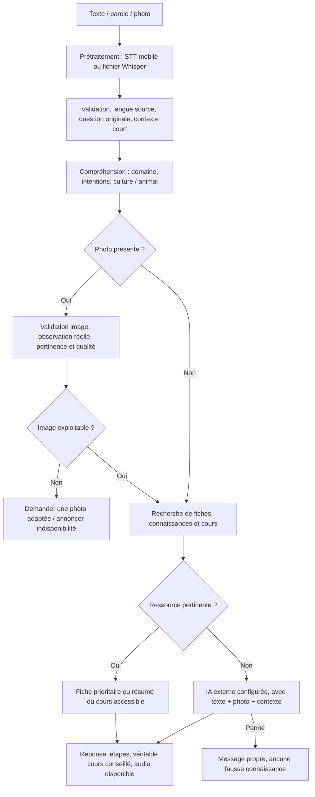

# Audit et fiabilisation de l'assistant SONGRA

Date : 7 octobre 2026. Périmètre : code local du backend et de l'application mobile Flutter.

Les corrections sont locales. Aucun déploiement sur la VM ni APK n'a été réalisé pour cette mission. La validation complète en conditions réelles reste conditionnée à une clé IA valide et à des essais sur téléphone. Les tests de fournisseurs simulés ne prouvent pas la qualité agronomique ou linguistique d'un modèle en production.

## Architecture examinée avant correction

| Élément | Implémentation existante |
|---|---|
| Application producteur | `songra_app/lib`, Flutter, Riverpod, Dio |
| Administration | `carema-admin/src`, React ; le fichier `dist/index.html` est un résultat de compilation |
| API principale | `backend/main.py`, FastAPI, authentification JWT, SQLAlchemy |
| Données | SQLite par défaut ; configuration `DATABASE_URL` existante |
| Fiches expertes | `ExpertLocalKnowledgeDB`, table `expert_local_knowledge`, états validés/résolus/vérifiés, traductions et audios JSON |
| Connaissances RAG | `KnowledgeItem`, moteur `retrieve_knowledge` |
| Cours | `AcademyCourseDB`, table `academy_courses`, cours publiés, périmètre d'organisation et contrôle d'accès existants |
| Historique et hors ligne | `ConsultationStore`, `OfflineService`, base hors ligne backend |
| Voix mobile principale | `speech_to_text` dans `VoiceService` : reconnaissance sur le téléphone, texte transmis à l'API |
| Voix Yingr secondaire | Whisper HTTP, `/audio/transcriptions`, fichier multipart dans `yingr_ai_services.py` |
| Analyse texte/photo | `v2_services.py`, appels compatibles Chat Completions, images base64 |
| Audio de réponse | Audios enregistrés dans les fiches Studio ; localisation choisie, lecture française proposée ; TTS français existant |
| Conversations | Historique court dans le parcours historique ; contrat v2 enrichi pour recevoir les six derniers tours |

Les trois endpoints `/api/v2/analyze`, `/api/v2/scanner/analyze` et `/api/v2/assistant/query` rejoignent désormais `_run_v2_pipeline`. Les API historiques sont conservées. Les alertes SOS restent un signalement distinct ; elles ne sont pas transformées en consultations agricoles.

## Bugs identifiés, causes et corrections

| Problème | Cause | Correction |
|---|---|---|
| Recherche technique ignorant des fiches utiles | Exclusion automatique des fiches pour `general_advice` et les techniques | Recherche interne aussi pour les techniques ; contrôle de pertinence contre les fiches de maladie sans rapport |
| IA appelée avant les fiches pour le texte | Analyse structurée générée avant la recherche | Fiches et aperçu du cours recherchés avant l'IA ; une ressource pertinente peut répondre sans fournisseur externe |
| Correspondances trompeuses | Mots communs, seul nom de culture, absence de vérification du sujet | Normalisation, pluriels, équivalences explicites, contrôle culture/animal, plusieurs termes significatifs et seuils configurables |
| Ail et poulets mal compris | Vocabulaire incomplet, symptômes au pluriel non reconnus | Ajout de cultures et mots métier ; reconnaissance des termites et mortalités ; catégories conservées |
| Cours présent mais réponse dépendante de l'IA | Le cours ne servait que de suggestion | Résumé accessible du véritable cours utilisé si aucune fiche n'est trouvée ; pas de divulgation des étapes payantes |
| Résultat remplacé par une absence de fiche | Fallback RAG générique écrasant l'analyse | Correction précédente conservée : une absence de ressource n'efface pas l'analyse utile |
| Panne durable après une erreur transitoire | Réponse de secours stockée dans le cache texte | Correction précédente conservée : pas de cache pour les secours ; anciennes entrées ignorées |
| Faux diagnostic lors d'une panne photo | Secours agricole déterministe même sans analyse visuelle | Message d'indisponibilité, aucune maladie ou action inventée |
| Images hors catégorie ou floues donnant une maladie | Absence de contrat vérifiable de pertinence et qualité | Contrat vision enrichi et garde serveur ; une image non pertinente, floue, inconnue ou inexploitable exige une nouvelle photo |
| Image invalide ou format incorrect transmis au modèle | Base64 simplement dépouillé de son préfixe | Décodage, lecture Pillow, limites de taille, contrôle de luminosité/contraste/taille, orientation EXIF et conversion JPEG |
| Faux accident vocal | Transcription Whisper simulée quand le service échouait | Échec explicite ; aucune transcription fabriquée |
| Faux diagnostic Yingr | Inférence simulée utilisée automatiquement après une panne | Service conservé, substitution simulée retirée du parcours réel ; message d'indisponibilité |
| Réponse JSON incomplète présentée comme diagnostic | Valeurs par défaut, tableaux `null`, confiance zéro perdue | Validation de contenu utile, listes normalisées, confiance zéro et valeurs non finies traitées, booléens vérifiés |
| Erreur mobile « Erreur serveur » | Le client cherchait `message`, FastAPI renvoie `detail` | Affichage du vrai détail textuel ; session expirée distinguée |
| Perte de langue et de question originale | Contrat v2 limité à une préférence audio | `source_lang`, `target_lang`, `input_type`, original conservé et normalisation locale à confiance contrôlée |
| Vocal local inaccessible | Le bouton d'écoute ouvrait la caméra en langue locale | Accès vocal ajouté sans retirer caméra/galerie ; reconstruction locale existante conservée |
| Erreur de transcription traitée par une seconde IA | Repli historique aveugle après toute erreur v2 | Repli vocal limité au cas de session française expirée ; une erreur locale exige de reformuler |
| Perte de contexte en v2 | Aucun historique dans la requête | Six derniers tours bornés ; sujet antérieur réutilisé pour une question de suivi ; écran de suivi relié au moteur v2 |
| Pannes réutilisées hors ligne comme connaissances | Toutes les consultations pouvaient être candidates | Historique conservé, réponses indisponibles/non exploitables exclues de la recherche locale |
| Facturation et corpus alimentés par des erreurs | Persistance/consommation inconditionnelles | Pas de consommation ni d'ajout au corpus serveur pour une panne ou une clarification photo |
| Toute réponse présentée comme maladie | Prompt et titre « Diagnostic » imposés | Rôle conseiller/formateur renforcé ; objectifs et étapes pour les techniques et apprentissages ; question complémentaire possible |
| Photo et question mal combinées dans les prompts secondaires | Champs v2 visuels omis et texte absent du prompt photo | Description et hypothèse v2 prises en compte, question explicite conservée |

## Pipeline résultant



Pour une photo, le modèle est nécessaire à l'observation avant le rapprochement des ressources. Sa sortie est réutilisée : pas de second appel général redondant. Une photo rejetée ne peut pas être transformée en fiche de maladie par la recherche.

Le contrat conserve les champs mobiles existants : `message`, `diagnostic`, `actions`, `urgence`, médias, localisations et cours. Il ajoute le contexte de requête et des indicateurs d'indisponibilité/clarification sans casser les anciens clients.

## Texte, voix et photo

- Texte : langue source explicite, contexte court, recherche interne, puis analyse externe si les ressources ne répondent pas. Une phrase manifestement française peut conserver une préférence de lecture locale sans retraduction inutile.
- Voix mobile : microphone et `speech_to_text`, transcription non vide, `input_type=voice`, langue source et préférence audio, même moteur. Une entrée vide ou un marqueur d'erreur provoque une demande de répétition.
- Fichier Whisper : les octets sont réellement envoyés dans le champ multipart `file`. Un résultat vide, une panne ou un endpoint absent ne produit aucun texte fictif.
- Photo : octets et taille vérifiés, contrôles visuels simples, orientation et format normalisés, photo et question envoyées ensemble. Le modèle doit préciser le sujet, la qualité et la pertinence. Une réponse ne renseignant pas correctement ces éléments est considérée non exploitable.
- Diagnostic : les hypothèses restent incertaines ; les actions et questions complémentaires sont adaptées au besoin et au contexte rural.
- Formation : objectif et étapes ; limites de concision assouplies jusqu'à dix étapes lorsque l'utilisateur demande un apprentissage détaillé.

## Fiches, cours, langues et audios

Fiches Studio validées et connaissances internes restent prioritaires. La recherche est une recherche lexicale enrichie d'équivalences, pas un nouveau moteur d'embeddings. Elle couvre notamment `cultiver/planter/culture`, pluriels et noms d'animaux. Elle ne prétend pas reconnaître toute paraphrase arbitraire.

Les quatre cas sont gérés : fiche + cours ; fiche seule ; cours seul avec résumé ; aucune ressource avec IA externe. Les suggestions portent sur des cours publiés réels, avec leur identifiant et la navigation existante. Le périmètre d'organisation et les droits d'accès sont conservés.

Français, Mooré, Dioula, Fulfuldé et les ressources existantes ne sont pas supprimés. Les traductions/reconstructions utilisent le mécanisme existant, avec un seuil de confiance. Les requêtes trop incertaines demandent une reformulation plutôt qu'une réponse inventée.

Les audios sont sélectionnés dans les données de la fiche. L'absence d'audio local est explicite. La disponibilité d'un audio français enregistré n'est plus annoncée sans URL réelle. Le mécanisme mobile de proposition de lecture française/TTS français est conservé ; aucun audio local n'est fabriqué.

La reconnaissance des langues locales reste dépendante du téléphone et de la reconstruction phonétique existante. Le moteur mobile utilise actuellement `fr_FR` pour ces langues, ce qui n'est pas une reconnaissance native Mooré/Dioula/Fulfuldé. Des essais avec des locuteurs sont indispensables avant de garantir une transcription fiable.

## Fournisseur et configuration réellement observés

| Paramètre | Valeur observée dans le code/configuration locale |
|---|---|
| Fournisseur actif | `AI_PROVIDER=groq` dans `backend/.env` |
| Endpoint | `https://api.groq.com/openai/v1/chat/completions` |
| Modèle configuré | `GROQ_MODEL=qwen/qwen3.6-27b` |
| Client | SDK compatible OpenAI, `base_url=https://api.groq.com/openai/v1` |
| Paramètres Groq | `max_tokens=2000` par défaut, température `0.1`, reasoning `none`, format hidden ; JSON selon l'appel |
| Timeout | `AI_TIMEOUT_SECONDS`, défaut 60 secondes ; attente asynchrone des appels synchrones existants |
| Cache texte | 300 secondes, maximum 500 entrées ; aucun secours mis en cache |
| Autres fournisseurs conservés | OpenAI, modèle configuré par `OPENAI_MODEL` (défaut `gpt-4o`) ; Gemini `gemini-2.5-flash` |
| Whisper secondaire | `YINGR_AI_WHISPER_URL` + `/audio/transcriptions`, modèle demandé `openai/whisper-large-v3`, langue française, timeout 30 secondes |

Un appel réel à la liste des modèles Groq et un appel texte minimal avec la clé du fichier local ont tous deux renvoyé **HTTP 401**, code **`invalid_api_key`**. Aucun secret n'a été affiché. On ne peut donc pas affirmer que ce modèle a réellement généré une réponse pendant cet audit. La clé de la VM n'a pas été inspectée.

La documentation actuelle [Groq Vision](https://console.groq.com/docs/vision) présente un modèle Qwen différent de la configuration locale. Le [catalogue officiel](https://console.groq.com/docs/models) doit être comparé aux modèles accessibles au compte après correction de la clé. Aucun changement arbitraire de modèle n'a été effectué.

Variables nécessaires/documentées dans `.env.example` :

```dotenv
AI_PROVIDER=groq
GROQ_API_KEY=<clé valide à renseigner sur le serveur>
GROQ_MODEL=qwen/qwen3.6-27b
AI_TIMEOUT_SECONDS=60
SONGRA_KNOWLEDGE_MIN_SCORE=4
SONGRA_COURSE_MIN_SCORE=2
SONGRA_LANGUAGE_MIN_CONFIDENCE=0.5
```

`GEMINI_API_KEY` reste nécessaire aux fonctions existantes de traduction/reconstruction Gemini et aux fonctions média Gemini utilisées. `OPENAI_API_KEY` reste utilisé si le fournisseur OpenAI ou ses services média sont activés. Les endpoints Yingr/Whisper ne sont nécessaires que pour les parcours correspondants. Le chargement de `backend/.env` et la priorité aux variables déjà présentes dans le processus sont conservés.

## Logs

`[SONGRA-PIPELINE]` expose type d'entrée, langues, longueur de question, nombre de tours, présence/qualité/pertinence d'image, domaine, intention, culture/animal, résultats de connaissance, identifiant et score de fiche, identifiant de cours, audio local disponible, repli et fournisseur/modèle.

Les nouveaux logs ne conservent pas le texte complet de la question/transcription, les octets audio, la photo ou la réponse IA. L'historique utilisateur garde la question originale selon le fonctionnement existant. Les erreurs de recherche et d'analyse sont journalisées par type d'exception.

## Fichiers concernés

- `backend/main.py` : moteur commun, priorités internes, recherche, cours, contexte, langues, logs, persistance et consommation conditionnelles.
- `backend/v2_services.py` : prompts, validation JSON, garde image, messages d'erreur, présentation pédagogique et paramètres configurables.
- `backend/yingr_ai_services.py` : retrait des substitutions simulées dans le STT et l'inférence réelle.
- `backend/.env.example` : variables de configuration documentées ; aucune clé réelle modifiée.
- `backend/tests/test_rural_multimodal_pipeline.py` : scénarios métier et défaillances.
- `songra_app/lib/services/songra_v2_service.dart` : contrat de langue/contexte, détail FastAPI, identification des résultats réutilisables et injection Dio pour les tests.
- `songra_app/lib/services/offline_service.dart` : exclusion des réponses de panne dans la recherche hors ligne.
- `songra_app/lib/screens/voice_assistant_screen.dart` : accès vocal local, transmission de langue/type, répétition et repli contrôlé.
- `songra_app/lib/screens/question_simple_screen.dart` et `ask_question_screen.dart` : transmission des langues choisies.
- `songra_app/lib/screens/answers_screen.dart` : suivi conversationnel vers v2 avec historique court.
- `songra_app/lib/screens/v2_result_screen.dart` : garde contre une illustration demandée à partir d'une réponse inexploitable.
- `songra_app/test/assistant_pipeline_test.dart` : détail FastAPI et transmission de langue/historique.
- `scanner_simple_screen.dart` : formatage ; sélection de langue existante conservée.

Aucun schéma de base, cours, fiche, audio, langue ou catégorie n'a été supprimé. Aucun remplacement de technologies n'a été introduit. La consolidation des endpoints élimine leurs duplications tout en conservant l'analyse, les médias optionnels, l'authentification et les quotas.

## Tests des 19 scénarios demandés

| N° | Scénario | Validation automatisée |
|---|---|---|
| 1 | Termites dans le maïs, texte | Domaine/intention et réponse utile contrôlée |
| 2 | Même question vocale | Transcription transmise au même moteur ; fichier Whisper envoyé et résultat vide rejeté |
| 3 | Fiche exacte | Fiche réelle en SQLite de test, aucune analyse externe |
| 4 | Formulation différente | Deux paraphrases retrouvent la même fiche |
| 5 | Cultiver l'ail | Fiche technique et cours interrogés |
| 6 | Cours présent | Identifiant et résumé du vrai cours retournés |
| 7 | Aucun cours | Réponse externe, aucune suggestion inventée |
| 8 | Poulets qui meurent | Élevage et santé animale reconnus |
| 9 | Langue locale | Question originale, langue source, préférence audio et normalisation conservées |
| 10 | Audio local présent | URL enregistrée choisie |
| 11 | Audio local absent, français présent | Absence locale et disponibilité française exactes |
| 12 | Photo de culture | Observation contrôlée, catégorie conservée |
| 13 | Photo d'animal | Même contrat avec catégorie élevage |
| 14 | Photo hors sujet | Aucune maladie ni fiche substituée ; nouvelle photo demandée |
| 15 | Photo floue | Rejet de la qualité déclarée ; obscurité testée localement |
| 16 | Photo + texte | Les deux entrées parviennent au même appel |
| 17 | Aucune connaissance | Appel IA automatique unique |
| 18 | IA indisponible | Réponse propre, aucune action fictive ni consommation d'analyse |
| 19 | Termites puis « Elles attaquent… » | Sujet précédent transmis et conservé |

Ces scénarios utilisent des ressources de test réelles et des réponses IA contrôlées. Les photos de contrat sont synthétiques. Les tests de qualité ne constituent pas une évaluation sur un corpus de photos terrain. Les tests vocaux ne constituent pas une mesure de reconnaissance acoustique sur téléphone.

Commandes exécutées :

```powershell
python -m pytest backend/tests -q
# Dans songra_app :
flutter test --no-pub
flutter analyze --no-pub --no-fatal-infos --no-fatal-warnings <fichiers modifiés>
```

Résultats : **50 tests backend réussis**, **3 tests Flutter réussis**. L'analyse des fichiers mobiles concernés ne relève aucune erreur de compilation. Elle relève des avertissements existants (éléments inutilisés et dépréciations `withOpacity`). Le test de démarrage Flutter affiche aussi un avertissement d'initialisation des notifications dans l'environnement de test ; le scénario d'authentification réussit.

## Points restant à résoudre ou à valider

1. Renseigner une clé Groq valide sur le poste/serveur concerné. Une modification de code ne peut pas réparer une clé refusée.
2. Vérifier avec cette clé que le modèle configuré est disponible au compte et prend bien en charge les images et le JSON. Ne migrer qu'après cette vérification.
3. Vérifier séparément la configuration de la VM ; les constats locaux ne prouvent pas sa configuration effective.
4. Tester avec un vrai téléphone : permissions microphone, reconnaissance française, locuteurs Mooré/Dioula/Fulfuldé, écoute des fichiers audio enregistrés, images agricoles/animales/hors sujet et images floues réelles.
5. Les limites visuelles locales repèrent des cas évidents ; le flou, le sujet et la catégorie reposent aussi sur la validation du modèle. Aucun diagnostic visuel automatique n'est une garantie clinique.
6. Déployer le backend corrigé et reconstruire l'application mobile pour les changements Flutter. Les modifications de cette mission ne sont pas encore poussées ni déployées.
7. Les dépendances Gemini et certaines API Flutter présentent des dépréciations préexistantes. Elles sont conservées pour éviter une migration non demandée ; leur modernisation relève d'un travail distinct.
8. La recherche enrichie reste limitée aux équivalences implémentées. Des embeddings peuvent être étudiés si un corpus d'évaluation démontre des paraphrases non retrouvées ; aucun service supplémentaire n'a été imposé.

Le code des ruptures identifiées est corrigé et testé localement. La mission ne doit pas être considérée validée en production tant que les points de configuration et les essais réels ci-dessus ne sont pas terminés.
